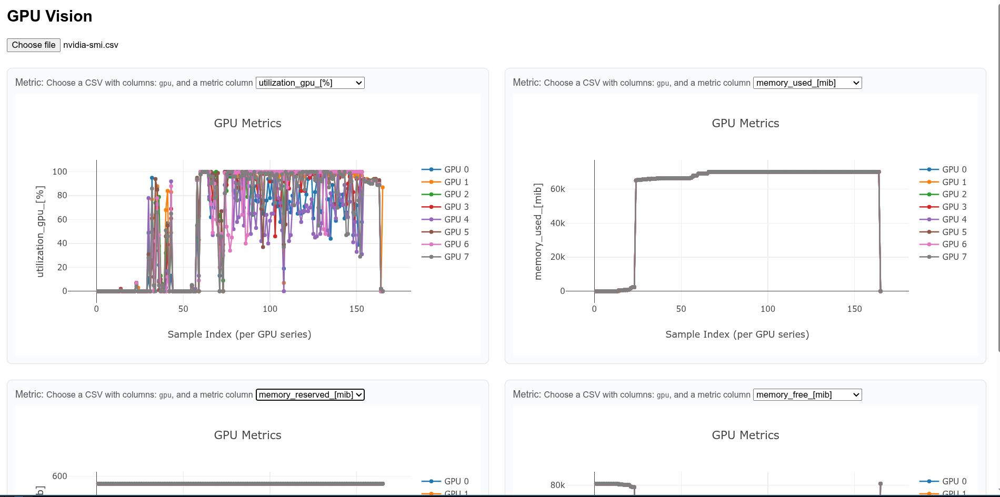

# README

Quick and dirty visualization of nvidia-smi data

## how to use
1. copy csv data into local `data` directory and done
2. `npm run dev` or equivalent package manager run command

## Assumptions
1. each row has timestamp data
2. timestamp data always (monotonically) increaseses
3. gpu id is tagged with "index"
